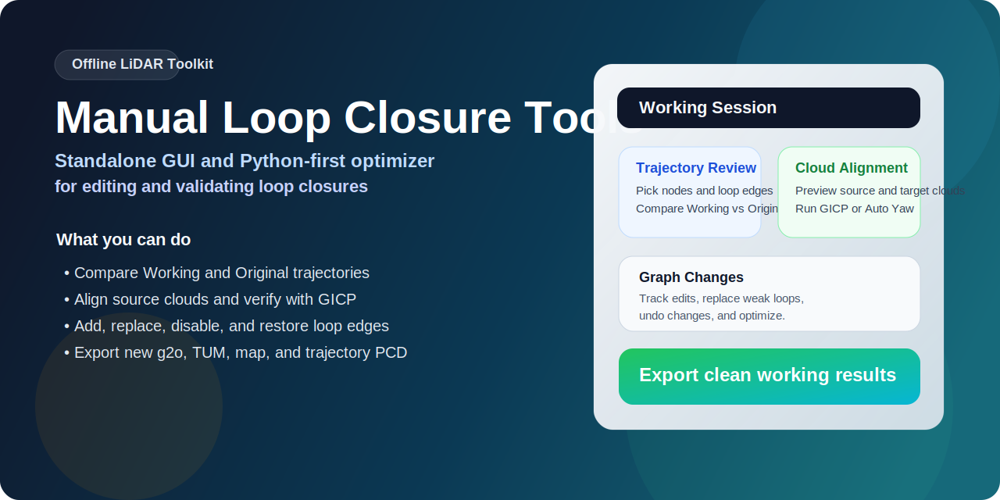
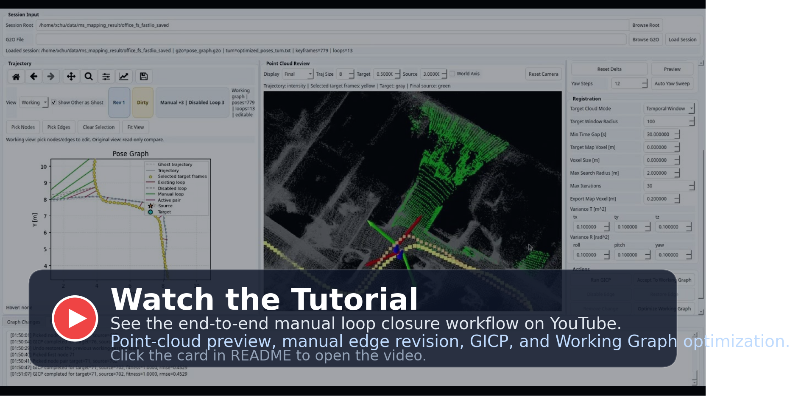
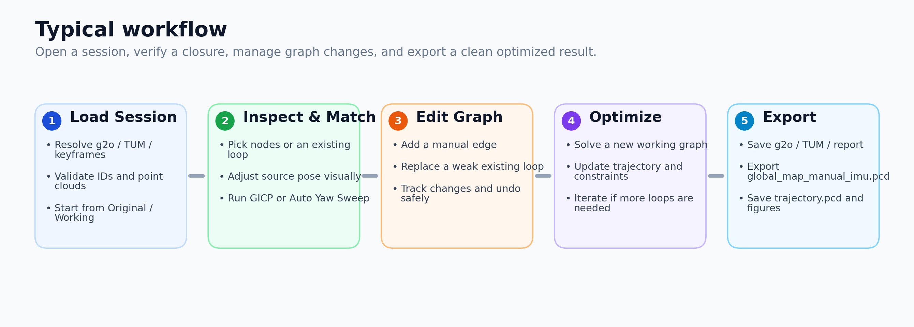

# Manual Loop Closure Tools

<p align="center">
  
</p>

<p align="center">
  <a href="https://github.com/JokerJohn/Mannual-Loop-Closure-Tools/actions/workflows/ci.yml">
    
  </a>
  
  
  
</p>

Offline manual loop closure editing and optimization tools for LiDAR mapping pose graphs.

用于激光雷达建图位姿图的离线手动闭环编辑与优化工具。

## Watch the Tutorial | 视频教程

<p align="center">
  <a href="https://youtu.be/lemd4XfPSYY">
    
  </a>
</p>

<p align="center">
  Click the card to watch the end-to-end workflow demo on YouTube.<br/>
  点击上方卡片可观看完整工具演示视频。
</p>

## Overview | 项目简介

This repository packages the manual loop-closure workflow into a standalone open-source project with:

本仓库将手动闭环工作流整理为一个独立的开源项目，包含：

- a PyQt GUI for trajectory inspection and point-cloud-assisted loop editing
- an offline optimizer backend for exporting new pose graphs and maps
- helper scripts for virtual environments, backend build, environment checks, and screenshot generation

- 用于轨迹检查和点云辅助闭环编辑的 PyQt 图形界面
- 用于导出新位姿图和地图的离线优化后端
- 用于虚拟环境、后端构建、环境检查和截图生成的辅助脚本

It is designed for mapping results that already contain:

它面向已经导出以下结果的建图任务：

- `pose_graph.g2o`
- `optimized_poses_tum.txt`
- `key_point_frame/*.pcd`

## Screenshots | 界面截图

<p align="center">
  
  
</p>

## Workflow | 工作流

<p align="center">
  
</p>

The GUI lets you inspect trajectories, select node pairs or existing loop edges, preview target/source point clouds, run GICP, add or replace loop constraints, manage a working graph session, and export a new optimized map.

图形界面支持轨迹检查、节点对和已有闭环边选择、source/target 点云预览、GICP 配准、手工新增或替换闭环约束、工作态位姿图管理，以及新优化地图导出。

## Key Features | 主要功能

| Feature | 功能 |
|---|---|
| Embedded PyQt + Open3D viewer | 内嵌式 PyQt + Open3D 点云查看器 |
| `Working` / `Original` trajectory comparison | `Working` / `Original` 双轨迹对比 |
| Manual edge add, replace, disable, restore | 手工新增、替换、禁用、恢复闭环边 |
| Interactive source alignment in point-cloud view | 在点云视图中直接调整 source 初值 |
| Auto yaw sweep for ground robots | 面向地面机器人的自动 yaw 遍历 |
| Offline optimizer exporting new `g2o`, `TUM`, map, and trajectory PCD | 离线优化器可导出新的 `g2o`、`TUM`、地图和轨迹点云 |
| Session-based graph editing with undo and change tracking | 带撤销和改动跟踪的工作会话式图编辑 |

## Quick Start | 快速开始

### Recommended path: `requirements.txt` + `.venv` | 推荐方式：`requirements.txt` + `.venv`

```bash
cd ~/my_git/Mannual-Loop-Closure-Tools
make venv
source .venv/bin/activate
make backend
python launch_gui.py --session-root /path/to/mapping_session
```

You can also point directly to a `g2o` file:

也可以直接指定某个 `g2o` 文件：

```bash
python launch_gui.py --g2o /path/to/pose_graph.g2o
```

### Alternative path: conda | 备选方式：conda

```bash
cd ~/my_git/Mannual-Loop-Closure-Tools
conda env create -f environment.yml
conda activate manual-loop-closure
make backend
python launch_gui.py --session-root /path/to/mapping_session
```

## Tested Environment | 当前测试环境

The current repository content was tested with the following dependency versions on Ubuntu 20.04 / ROS Noetic.

当前仓库内容在 Ubuntu 20.04 / ROS Noetic 环境下使用如下依赖版本进行了测试。

| Component | Version |
|---|---|
| Ubuntu | 20.04 |
| ROS | Noetic |
| Python | 3.10.16 |
| catkin_tools | 0.9.4 |
| Open3D | 0.19.0 |
| PyQt5 | 5.15.10 |
| Qt | 5.15.2 |
| NumPy | 1.24.4 |
| SciPy | 1.14.1 |
| Matplotlib | 3.10.8 |
| CMake | 3.25.0 |
| GCC / G++ | 9.4.0 |
| OpenCV | 4.2.0 |
| PCL | 1.10.0 |
| GeographicLib | 1.50.1 |
| GTSAM | 4.3.0 |

## Output Artifacts | 导出结果

After optimization, the tool exports a new run directory under the input session:

优化完成后，工具会在输入 session 下生成新的运行目录：

- `edited_input_pose_graph.g2o`
- `manual_loop_constraints.csv`
- `pose_graph.g2o`
- `optimized_poses_tum.txt`
- `global_map_manual_imu.pcd`
- `trajectory.pcd`
- `pose_graph.png`
- `manual_loop_report.json`

## Repository Layout | 仓库结构

```text
Mannual-Loop-Closure-Tools/
├── README.md
├── CHANGELOG.md
├── CONTRIBUTING.md
├── LICENSE
├── Makefile
├── requirements.txt
├── environment.yml
├── launch_gui.py
├── assets/
├── docs/
├── gui/
├── backend/
│   └── catkin_ws/
│       └── src/
│           ├── CMakeLists.txt
│           └── manual_loop_closure_backend/
└── scripts/
```

## Documentation | 文档

- [Installation Guide / 安装说明](docs/INSTALL.md)
- [Tool Manual / 工具说明](docs/TOOL_README.md)
- [Contributing / 贡献说明](CONTRIBUTING.md)
- [Changelog / 版本记录](CHANGELOG.md)

## Developer Utilities | 开发辅助

```bash
make help
make check
make env-check
make backend
make assets SESSION_ROOT=/path/to/session
```

## Open-Source Notes | 开源说明

This repository focuses on the standalone manual-loop-closure workflow only. It does not include the full online mapping stack.

本仓库聚焦于独立的手动闭环工具链，不包含完整的在线建图系统。

This project is derived from and complements the broader **MS-Mapping** research and codebase:

本项目源自并服务于更完整的 **MS-Mapping** 研究与代码体系：

- Project URL / 项目地址: https://github.com/JokerJohn/MS-Mapping

If you use this repository in academic work, please also cite the MS-Mapping paper:

如果你在学术工作中使用了本仓库，也请同时引用 MS-Mapping 论文：

```bibtex
@misc{hu2024msmapping,
      title={MS-Mapping: An Uncertainty-Aware Large-Scale Multi-Session LiDAR Mapping System},
      author={Xiangcheng Hu, Jin Wu, Jianhao Jiao, Binqian Jiang, Wei Zhang, Wenshuo Wang and Ping Tan},
      year={2024},
      eprint={2408.03723},
      archivePrefix={arXiv},
      primaryClass={cs.RO},
      url={https://arxiv.org/abs/2408.03723},
}
```

## License | 许可

This standalone repository is released under the MIT License.

本独立仓库采用 MIT License。
